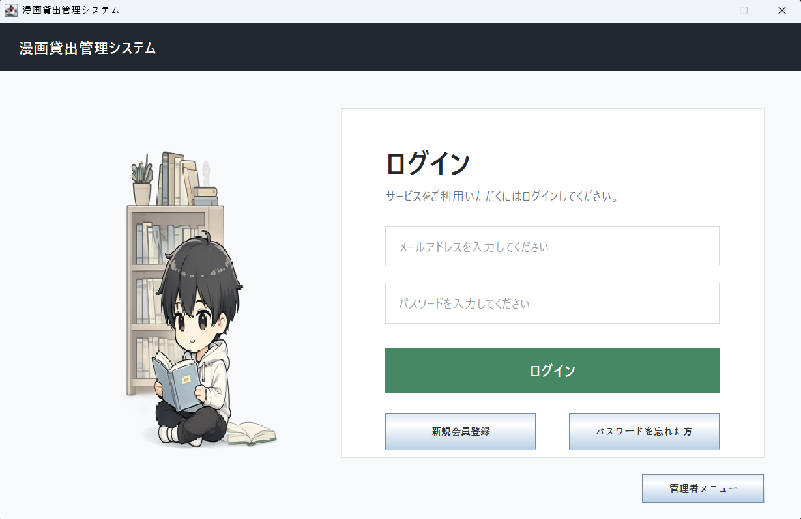
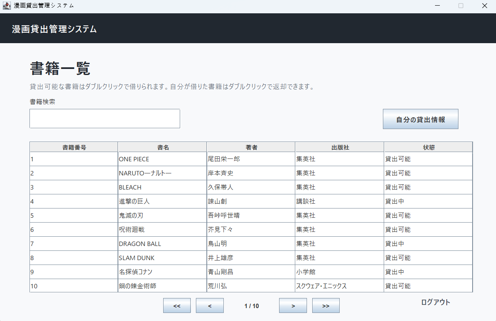
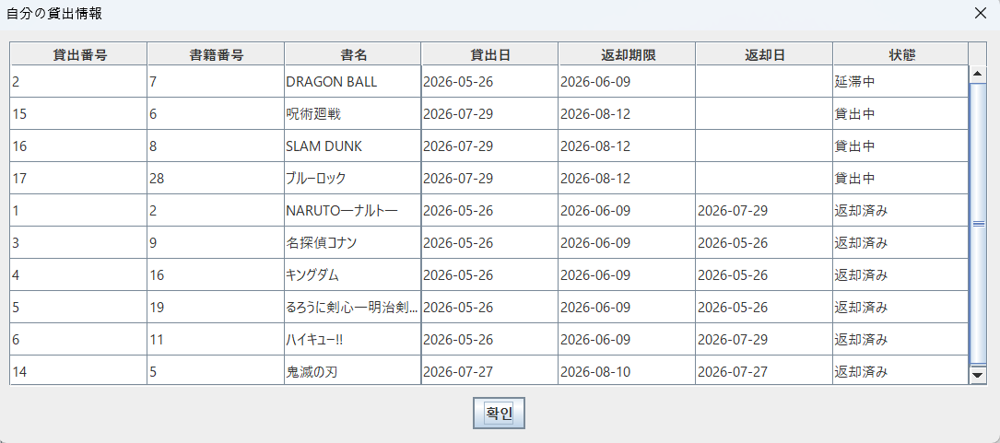
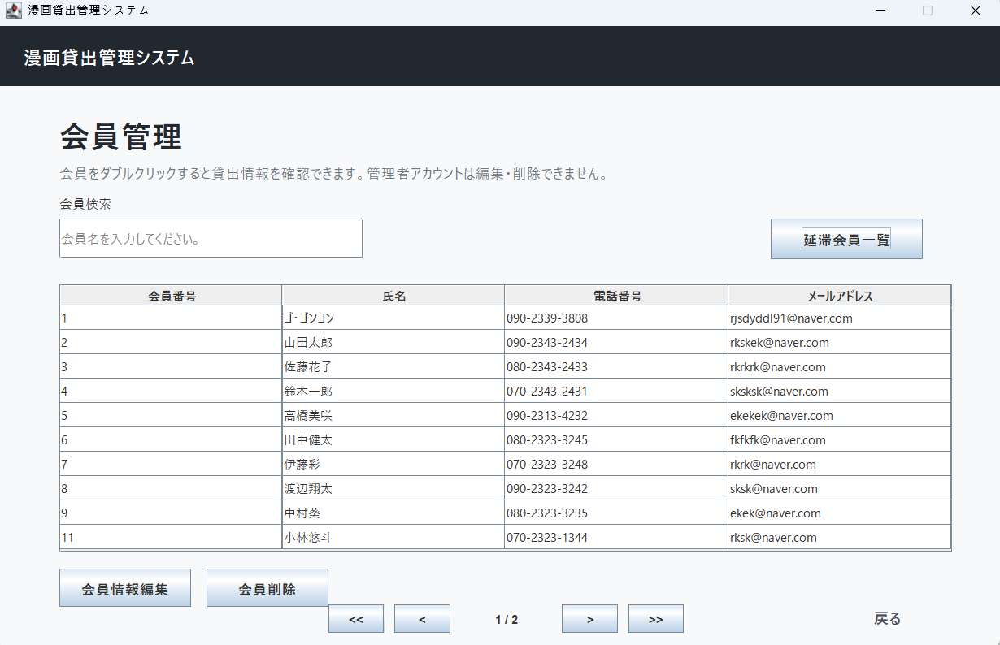
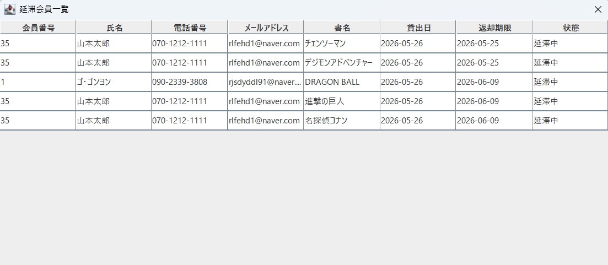
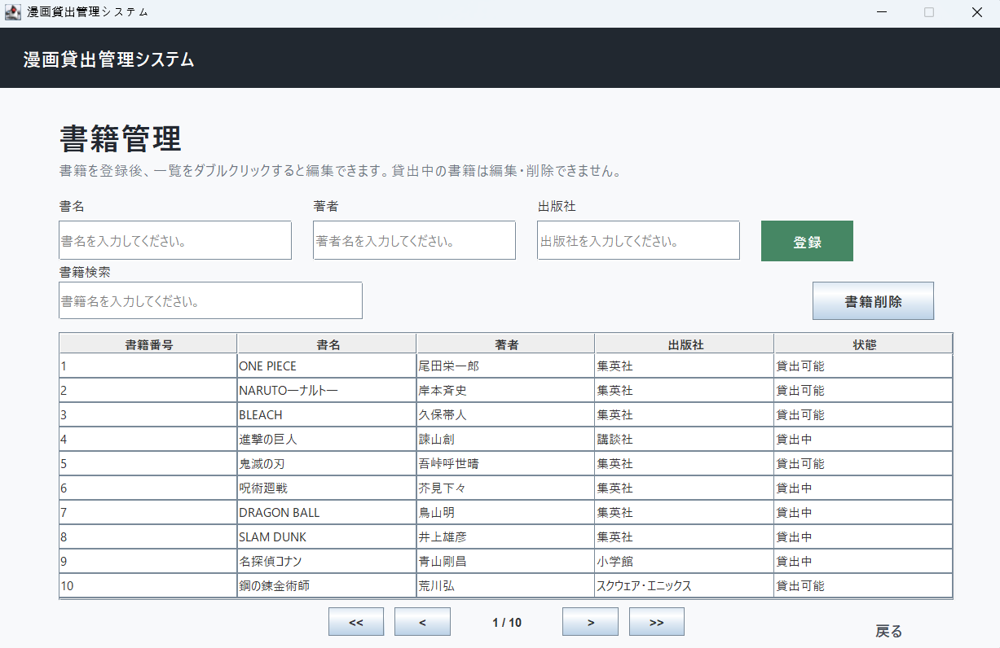

# 漫画貸出管理システム

Java SwingとMySQLを使用して開発した、漫画の貸出・返却を管理するデスクトップアプリケーションです。

利用者向けの書籍検索・貸出・返却機能と、管理者向けの書籍・会員・延滞情報管理機能を実装しました。

> 本ブランチは、韓国語版（main）を基に、画面表示およびデータの状態値を日本語化したバージョンです。

---

## 1. プロジェクト概要

会員、書籍、貸出情報をMySQLで管理し、利用者と管理者の役割に応じた機能を提供するシステムです。

利用者は、書籍の検索・貸出・返却、自分の貸出履歴や返却期限の確認ができます。  
管理者は、書籍と会員情報の管理に加え、返却期限を過ぎた会員と書籍を一覧で確認できます。

本プロジェクトでは、Java Swingによる画面作成、JDBCを利用したデータベース連携、DAOを用いたデータアクセス処理を実装し、デスクトップアプリケーション開発の一連の流れを学ぶことを目的としました。

---

## 2. プロジェクト情報

| 項目 | 内容 |
|---|---|
| プロジェクト名 | 漫画貸出管理システム |
| 開発形態 | 個人開発 |
| 初期開発期間 | 21日間 |
| 追加作業 | 日本語化、延滞状態判定処理のリファクタリング |
| 開発内容 | DB設計、DAO実装、Swing画面作成、動作確認、不具合修正、リファクタリング |
| 動作環境 | ローカル環境 |

---

## 3. 使用技術

| 分類 | 技術 | 使用内容 |
|---|---|---|
| Language | Java | 業務ロジック、画面イベント、データ処理 |
| GUI | Java Swing | 利用者画面および管理者画面の作成 |
| Database | MySQL | 会員、書籍、貸出情報の管理 |
| Database Access | JDBC / PreparedStatement | SQL実行およびデータベース接続 |
| Design | DAO / VO | データアクセス処理とデータ保持処理の分離 |
| Version Control | Git / GitHub | バージョン管理、韓国語版と日本語版のブランチ管理 |

---

## 4. 主な機能

### 利用者機能

- 会員登録
- ログイン、ログアウト
- パスワード検索
- 書籍一覧の表示
- 書名による検索
- 書籍一覧のページ移動
- 貸出可能な書籍の貸出
- 貸出中または延滞中の書籍の返却
- 自分の貸出履歴の確認
- 貸出日、返却期限、返却日、貸出状態の確認

### 管理者機能

- 書籍の登録、検索、修正、削除
- 会員情報の検索、修正、削除
- 会員ごとの貸出情報確認
- 延滞中の会員および書籍の一覧表示
- 貸出状態と返却期限の確認

---

## 5. 画面

### 5.1 ログイン画面

利用者のログイン、会員登録、パスワード検索、管理者画面への移動ができます。

<p align="center">
  
</p>

### 5.2 利用者画面

登録されている書籍を一覧で確認できます。  
書名検索とページ移動に対応し、選択した書籍の状態に応じて貸出または返却を行えます。

<p align="center">
  
</p>

### 5.3 自分の貸出情報

ログイン中の利用者が借りた書籍の履歴を確認できます。

貸出日、返却期限、返却日とともに、`貸出中`、`延滞中`、`返却済み`の状態を表示します。

<p align="center">
  
</p>

### 5.4 会員管理画面

管理者は会員を検索し、会員情報の修正・削除を行えます。  
また、選択した会員の貸出履歴を確認できます。

<p align="center">
  
</p>

### 5.5 延滞会員一覧

返却期限を過ぎても返却されていない貸出情報を自動的に判定し、延滞中の会員と書籍を一覧で表示します。

<p align="center">
  
</p>

### 5.6 書籍管理画面

管理者は書籍情報の登録、検索、修正、削除を行えます。  
書籍の貸出状態も一覧で確認できます。

<p align="center">
  
</p>

---

## 6. DB設計

### 6.1 テーブル構成

| テーブル・View | 内容 | 主な項目 |
|---|---|---|
| `EX_MEMBER` | 会員情報 | `MEMBER_ID`, `NAME`, `PHONE`, `EMAIL`, `PASSWORD` |
| `EX_BOOK` | 書籍情報 | `BOOK_ID`, `TITLE`, `AUTHOR`, `PUBLISHER`, `BOOK_STATUS` |
| `EX_RENTAL` | 貸出・返却履歴 | `RENTAL_ID`, `MEMBER_ID`, `BOOK_ID`, `RENTAL_DATE`, `DUE_DATE`, `RETURN_DATE`, `RENTAL_STATUS` |
| `V_RENTAL_STATUS` | 画面表示用の貸出状態を算出するView | 会員情報、書籍情報、貸出情報、`DISPLAY_STATUS` |

### 6.2 テーブル関係

```text
EX_MEMBER 1 ─── N EX_RENTAL N ─── 1 EX_BOOK
```

1人の会員は複数の貸出履歴を持つことができ、1冊の書籍も返却後に複数の貸出履歴を持つことができます。

`EX_RENTAL`では、`MEMBER_ID`と`BOOK_ID`を外部キーとして管理しています。

### 6.3 貸出状態の管理

データベースに保存する状態と、画面に表示する状態を分けて管理しています。

| 管理対象 | 状態 |
|---|---|
| `EX_BOOK.BOOK_STATUS` | `貸出可能`、`貸出中` |
| `EX_RENTAL.RENTAL_STATUS` | `貸出中`、`返却済み` |
| `V_RENTAL_STATUS.DISPLAY_STATUS` | `貸出中`、`延滞中`、`返却済み` |

`延滞中`はデータベースに直接保存せず、以下の条件をもとに`V_RENTAL_STATUS`で算出します。

```text
貸出状態が「貸出中」
かつ RETURN_DATE が未登録
かつ DUE_DATE が現在日より前
→ 画面表示状態を「延滞中」とする
```

これにより、日付が変わった場合でもデータを直接修正することなく、現在の返却期限を基準に延滞状態を表示できます。

---

## 7. 工夫・改善した点

### 7.1 延滞状態判定処理の共通化

当初は、利用者画面などではJavaで返却期限と現在日を比較し、管理者の延滞会員一覧ではSQLで延滞状態を判定していました。

そのため、同じ貸出情報に対する判定処理が複数の画面に分散し、画面ごとに異なる結果が表示される可能性がありました。

この問題を改善するため、MySQLの`V_RENTAL_STATUS`で表示用の貸出状態を一元的に算出するように変更しました。

改善後は、DAOがViewから`DISPLAY_STATUS`を取得し、各画面は取得した状態をそのまま表示します。

```text
改善前
JavaとSQLの複数箇所で延滞状態を判定

改善後
MySQL Viewで延滞状態を一元的に判定
```

これにより、利用者画面と管理者画面で同じ基準を使用できるようになり、重複していた日付比較処理も削減できました。

### 7.2 貸出・返却処理の整合性

貸出・返却処理では、貸出履歴と書籍状態が一致するように処理を構成しました。

#### 貸出時

1. `EX_RENTAL`に貸出情報を登録
2. 貸出日を現在日に設定
3. 返却期限を貸出日の14日後に設定
4. `EX_BOOK.BOOK_STATUS`を`貸出中`に変更

#### 返却時

1. 対象となる貸出情報を確認
2. `RETURN_DATE`に返却日を登録
3. `RENTAL_STATUS`を`返却済み`に変更
4. `EX_BOOK.BOOK_STATUS`を`貸出可能`に変更

開発中には、貸出履歴は正常に登録されているものの、書籍状態が`貸出可能`のまま変更されない不具合が発生しました。

原因を確認するため、以下の順序で処理結果を検証しました。

1. `EX_RENTAL`への貸出情報登録結果
2. 書籍状態更新処理の実行結果
3. MySQL上の`BOOK_STATUS`

その結果、書籍状態の更新処理で誤った状態値を設定していたことを確認し、`貸出中`へ変更されるように修正しました。

この経験を通じて、複数のテーブルを更新する処理では、画面上の結果だけでなく、処理ごとの戻り値とデータベース上の保存結果を段階的に確認することが重要だと学びました。

---

## 8. 実行方法

### 8.1 日本語版リポジトリ

日本語版のソースコードは、以下のブランチから確認できます。

[日本語版リポジトリ（jp-version）](https://github.com/rjsdyddl91/library-management-program/tree/jp-version)

ローカル環境に取得する場合は、以下のコマンドを実行します。

```bash
git clone -b jp-version --single-branch https://github.com/rjsdyddl91/library-management-program.git
cd library-management-program
```

### 8.2 SQLファイル構成

| ファイル | 内容 |
|---|---|
| `init_library_db_jp.sql` | データベースと会員・書籍・貸出テーブルを作成します。 |
| `sample_data_jp.sql` | 書籍100冊、デモ会員、動作確認用の貸出履歴を登録します。 |
| `create_v_rental_status.sql` | 画面表示用の貸出状態を算出するViewを作成します。 |

`sample_data_jp.sql`には、`貸出中`、`延滞中`、`返却済み`の各状態を確認できる貸出履歴が含まれています。  
日付は実行日を基準に自動計算されるため、実行時期にかかわらず延滞状態を確認できます。

### 8.3 データベースの準備

MySQLで、以下の順番にSQLファイルを実行します。

1. `sql/init_library_db_jp.sql`
2. `sql/sample_data_jp.sql`
3. `sql/create_v_rental_status.sql`

> `sample_data_jp.sql`は、`init_library_db_jp.sql`の実行後に1回だけ実行してください。

### 8.4 Java実行環境の設定

1. プロジェクトをJava開発環境にインポートします。
2. MySQL Connector/Jをクラスパスに設定します。
3. MySQLのパスワードを環境変数`LIBRARY_DB_PASSWORD`に設定します。
4. ログイン画面を起動するメインクラスを実行します。

データベース接続情報は、以下の環境変数から取得します。

| 環境変数 | 内容 | 未設定時の値 |
|---|---|---|
| `LIBRARY_DB_URL` | JDBC接続先 | `jdbc:mysql://localhost:3306/library_db_jp` |
| `LIBRARY_DB_USER` | MySQLユーザー名 | `root` |
| `LIBRARY_DB_PASSWORD` | MySQLパスワード | 設定必須 |

Windows PowerShellでは、以下のようにパスワードを設定します。

```powershell
$env:LIBRARY_DB_PASSWORD="自分のMySQLパスワード"
```

接続先やユーザー名が異なる場合は、必要に応じて以下も設定します。

```powershell
$env:LIBRARY_DB_URL="jdbc:mysql://localhost:3306/library_db_jp"
$env:LIBRARY_DB_USER="root"
```

環境変数を設定したターミナルからアプリケーションを実行してください。

### 8.5 デモ用ログイン情報

#### 利用者

| 項目 | 内容 |
|---|---|
| メールアドレス | `demo@example.com` |
| パスワード | `demo1234` |

デモ会員でログインすると、`貸出中`、`延滞中`、`返却済み`の貸出履歴を確認できます。

#### 管理者

| 項目 | 内容 |
|---|---|
| 管理者パスワード | `3808` |

ログイン画面の管理者ボタンから上記のパスワードを入力すると、書籍・会員・延滞情報の管理機能を確認できます。

---

## 補足

本プロジェクトはローカル環境での動作を前提としています。

初期開発後、日本語対応に加え、延滞状態判定処理の見直しと共通化を行いました。